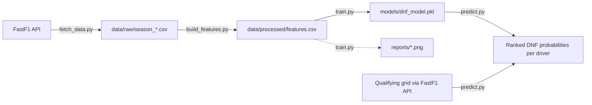
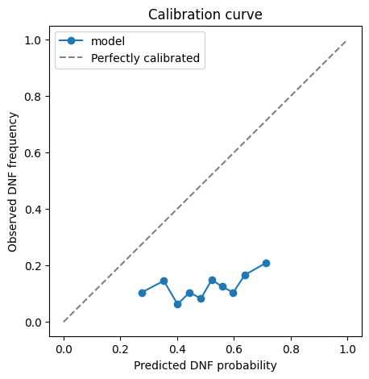
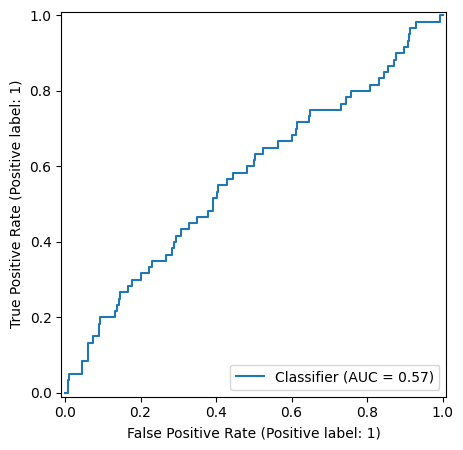
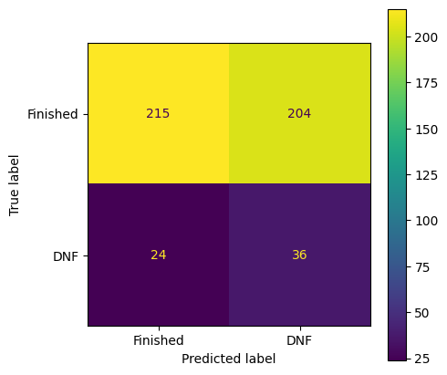

# F1 DNF Predictor

Predicting Formula 1 driver DNF (Did Not Finish) risk using logistic regression,
built on historical race data from [FastF1](https://github.com/theOehrly/Fast-F1).

**Live test case:** 2026 Hungarian Grand Prix (Round 11) — predictions generated
from Saturday's qualifying grid, validated against Sunday's actual race results.

---

## Why this project

F1 strategy and reliability teams model risk constantly — safety car probability
shapes pit strategy, and reliability engineering is fundamentally about managing
DNF risk under performance pressure. This project is a small, honest version of
that kind of modeling: given a driver's grid position, recent reliability history,
team reliability, and circuit history, how likely are they to retire before the
finish?

## Data

- **[FastF1](https://github.com/theOehrly/Fast-F1)** — race results, qualifying
  grids, and weather data, seasons 2022–2026 (partial).
- Ergast was deprecated in 2025; FastF1 (backed by the F1 live timing API) is the
  current standard for this kind of work.

## Architecture / workflow

The pipeline is four independent, chainable scripts — each reads the previous
step's output from disk rather than passing objects in memory, so any step can
be rerun on its own (e.g. re-run `predict.py` for a new race without re-fetching
or re-training anything).



| Script | Input | Output | Responsibility |
|---|---|---|---|
| `fetch_data.py` | FastF1 API | `data/raw/season_*.csv` | Pull raw results + weather per season, cache locally |
| `build_features.py` | `data/raw/*.csv` | `data/processed/features.csv` | Engineer leakage-free rolling features |
| `train.py` | `data/processed/features.csv` | `models/dnf_model.pkl`, `reports/*.png` | Fit + evaluate logistic regression, chronological split |
| `predict.py` | `models/dnf_model.pkl`, live qualifying data | Ranked DNF probability table (CSV) | Predict an upcoming race |

**Key design choice:** all rolling features (`driver_dnf_rate_last5`,
`team_dnf_rate_last5`, `circuit_dnf_rate_hist`) are computed with `.shift(1)`
before the rolling/expanding window, so no race's outcome ever leaks into its
own features. The train/test split is **chronological by season** (train
2022–2024, test 2025), not random — races within a season are correlated, and
a random split would leak information between them.

## Results

Trained on 2022–2024 (1359 rows), tested on 2025 (479 rows).

| Metric | Value |
|---|---|
| Train DNF rate | 14.3% |
| Test DNF rate | 12.5% |
| F1 score (DNF class) | 0.24 |
| ROC-AUC | 0.571 |
| Precision (DNF) | 0.15 |
| Recall (DNF) | 0.60 |

**On the metrics, honestly:** an earlier version of this model scored ROC-AUC
0.766, using a looser DNF definition that also captured `'Not Classified'`
(laps-down) finishes. Those correlate strongly with grid position and pace,
which made the problem artificially easier. Tightening the target to genuine
DNFs (mechanical failure, collision, retirement) dropped ROC-AUC to 0.571 —
barely above random. That's a real result, not a bug: true DNFs are dominated
by causes that are close to irreducible from pre-race data alone (a first-lap
collision, a random component failure). The model still recalls 60% of actual
DNFs, at the cost of a lot of false positives (precision 0.15) — expected
given `class_weight="balanced"` is deliberately biased toward not missing DNFs.

**Coefficients** (higher = more DNF risk):

- `circuit_dnf_rate_hist` (+0.42) and `GridPosition` (+0.20) both push risk up
  in the expected direction — circuit history and starting further back both
  increase DNF likelihood.
- Team coefficients still dominate the model (Williams +0.63, Alfa Romeo +0.45
  vs. Kick Sauber −0.73, McLaren −0.70), while the engineered
  `team_dnf_rate_last5` feature stays close to zero (−0.024). This points to
  multicollinearity: `TeamName` and the team's rolling DNF rate carry
  overlapping information, so the model puts almost all its weight on the
  categorical dummy. **Next step:** retrain without the raw `TeamName`
  one-hot and see whether `team_dnf_rate_last5` picks up that signal on its
  own — this would also make the model generalize better to teams that
  rebrand (e.g. Alfa Romeo → Kick Sauber → Audi).

## Graphs

Generated by `train.py`, saved to `reports/`:


*Predicted DNF probability vs. observed frequency. Points close to the
diagonal mean the model's probabilities are trustworthy, not just its
rankings.*


*True positive rate vs. false positive rate across thresholds — the basis for
the 0.571 AUC above.*


*Class-level breakdown behind the precision/recall numbers in the table above.*

## Live prediction: 2026 Hungarian Grand Prix

<!-- Fill in Saturday after qualifying -->

Predicted DNF risk per driver, based on Saturday's qualifying grid:

| Driver | Team | Grid | Predicted DNF % |
|---|---|---|---|
| TBD | | | |

## Post-race validation

<!-- Fill in Sunday after the race -->

Actual result vs. prediction:

| Driver | Predicted DNF % | Actual result |
|---|---|---|
| TBD | | |

**What went right / wrong:** TBD.

## Limitations

- True DNFs (as opposed to laps-down finishes) are inherently close to the
  ceiling of what pre-race features can predict — see Results above.
- Small sample size relative to the number of features; regulation changes
  between eras limit how far back multi-season training data can usefully go.
- `TeamName` and `team_dnf_rate_last5` show multicollinearity (see Results) —
  current coefficients should be read with that in mind.
- Weather at prediction time is a historical circuit average, not a live
  forecast — a production version would pull an actual weather API.
- Logistic regression is not the best model as most of the data is non-linear (for future improvement)

## Running it locally (without Docker)

```bash
pip install -r requirements.txt

python src/fetch_data.py --seasons 2022 2023 2024 2025 2026
python src/build_features.py
python src/train.py
python src/predict.py --year 2026 --event "Hungarian Grand Prix"
```

## Running it with Docker

This is the setup anyone can use to reproduce the whole pipeline without
installing Python or any dependencies locally — just Docker.

```bash
# 1. Clone the repo
git clone https://github.com/Wolfie-png/f1-dnf-predictor
cd f1-dnf-predictor

# 2. Build the image (installs all dependencies inside the container)
docker compose build

# 3. Run each pipeline step through the container, in order.
#    docker-compose.yml mounts ./data, ./models, and ./reports back onto
#    your machine, so everything the container generates persists locally
#    even after the container exits.
docker compose run app python src/fetch_data.py --seasons 2022 2023 2024 2025 2026
docker compose run app python src/build_features.py
docker compose run app python src/train.py
docker compose run app python src/predict.py --year 2026 --event "Hungarian Grand Prix"
```

**Notes on this setup:**
- The container needs outbound internet access to reach the FastF1 data
  source — this works by default on most machines, but will fail behind a
  restrictive corporate firewall/proxy.
- If `data/`, `models/`, or `reports/` don't exist yet on a fresh clone (git
  doesn't track empty folders), Docker will create them automatically on
  first run — no manual setup needed.
- Each `docker compose run` spins up a fresh, disposable container — only the
  mounted folders (`data/`, `models/`, `reports/`) persist between runs.

## Project structure

```
f1-dnf-predictor/
├── data/{raw,processed}/
├── src/{fetch_data,build_features,train,predict}.py
├── models/dnf_model.pkl
├── reports/{confusion_matrix,roc_curve,calibration_curve}.png
├── Dockerfile
├── docker-compose.yml
└── requirements.txt
```
